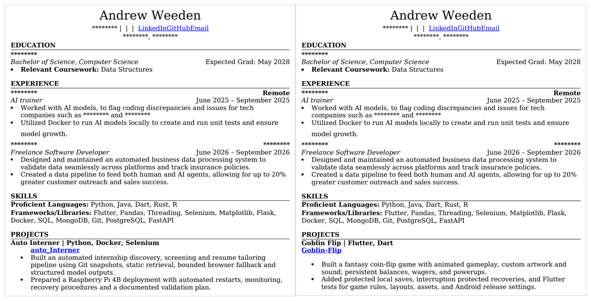

# Curat0r

**Curate a resume from the work you have actually done.**

Point it at your GitHub, upload your LinkedIn export, paste a job posting. It
builds a corpus of your real work, you confirm what's true, and it selects the
right subset for each application — with an honest report of what the posting
wanted that you don't have.

It never writes a claim about you. That's the whole design.

---

## Status

**Phase 0 complete.** 1,425 lines, 101 tests, no runtime dependencies. The
guarantees are built and tested; what is missing is reach — the GitHub fetcher
behind `RepoFetcher` has no implementation, so every source runs on fixtures.

Six phases planned: [ROADMAP.md](ROADMAP.md).

## What it produces



**Same corpus. Same person. Two different documents.**

Left is a data-platform internship, right is mobile. The projects section differs
because the postings do. Nothing was rewritten — both are the base résumé with
different paragraphs removed.

| | data platform | mobile |
|---|---|---|
| kept | Auto Interner | Goblin Flip |
| dropped | Goblin Flip | Auto Interner |
| coverage | 88% | 100% |

`********` marks a masked field. Asterisks rather than plausible substitutions,
because "Insurance Services Client" reads as real content and misrepresents the
document.

### The corpus behind it

Résumé sections plus public GitHub repositories, screened and deduplicated:

```
2 kept, 3 dropped
  drop  neetcode-submissions  - exercise or interview practice, not a built thing
  drop  WeedenAndrew          - your GitHub profile README, not a project
  drop  bbit-learning-labs    - a fork - the work is someone else's unless you say otherwise
```

`Auto Interner` from the résumé and `auto_Interner` from GitHub are one project.
Deduplication keeps the richer block — usually the résumé, because the user wrote
it about the work rather than about the repository.

### Sources supply different things

A repository is not a job. Pooling them makes a corpus where a repo competes with
employment for the same slot.

| material | comes from |
|---|---|
| work history | Base résumé · LinkedIn · Indeed profile |
| projects | GitHub · Kaggle · Base résumé |
| education | Base résumé · LinkedIn · Indeed profile |
| postings | Indeed · Glassdoor |

`coverage_gaps()` reports which of these you have nothing for, so a thin résumé
is diagnosable rather than just thin.

## Why this exists

`auto_Interner` is a personal tool: one user, one Raspberry Pi, one résumé,
running on a schedule. It works, and it stays that way.

Curat0r is what it looks like as something other people can use. Same engine,
three things added: **ingestion** (fill the corpus automatically instead of
hand-writing it), **multi-user**, and **a UI**.

## The guarantee

Every other AI résumé tool generates text and hopes it's true. Ask one to
tailor you toward a Kubernetes role and it will happily give you Kubernetes
experience.

Curat0r cannot, because it does not generate. It maintains a corpus of blocks
*you* wrote and confirmed, and tailoring **selects a subset**. The model chooses
what to show, never what is true. Worst case is a badly chosen true statement —
a ranking bug, not a fabricated credential you have to defend in an interview.

When a posting asks for something you don't have, it says so:

```
GAPS — nothing in your corpus supports these:
  [preferred] kafka
       posting said: "Familiarity with Kafka or another message queue"
```

A named gap is either a real reason not to apply or a prompt to add something
true. Both beat an invented bullet.

## Sources, and why only one is automated

| Source | How | Why |
|---|---|---|
| **GitHub** | Public REST API | Sanctioned programmatic access |
| **Kaggle** | Official public API + your token | Sanctioned; competitions and notebooks are real project evidence |
| **Base résumé** | You upload a `.docx` | Your own file. Fastest way to seed a corpus — the prose is already yours |
| **LinkedIn** | You upload your own data export | Scraping is prohibited; your own archive isn't, and it's richer |
| **Indeed / Glassdoor** | You paste the posting | Scraping is prohibited; pasting costs one keystroke |

This is enforced in code, not documented as a convention. `require_auto_fetchable()`
gates every fetch and refuses anything not sanctioned — with guidance attached,
so a refusal tells you what to do instead of just saying no.

Framed correctly it's a strength. A product built on scraping is one
enforcement action away from dead. This one isn't.

## Ingestion produces drafts, never facts

A repository description was written by past-you at 2am. It is not evidence
until present-you agrees.

So every ingested block arrives `_verified: false`, and the selection engine
only ever sees verified blocks. Draft bullets state exactly what GitHub
asserts — name, description, primary language — and nothing more. No
"architected a scalable system" from a repo with four commits. There is a test
asserting the embellishment vocabulary never appears.

Re-ingesting never overwrites what you wrote. A verified or edited block is
protected; the incoming change is held as a pending update you can accept. The
raw material is reproducible, your prose isn't.

## Architecture

```
GitHub API ─┐
LinkedIn export ─┼──▶ drafts ──▶ [you verify] ──▶ corpus ──┐
pasted history ─┘                                          │
                                                           ▼
job posting ────────▶ requirements ──────▶ selection ──▶ resume
                      (required/preferred)  (max-coverage  + gap report
                                             under a budget)
```

Curat0r emits the exact corpus JSON that `auto_interner.corpus` reads. The two
projects share a **format, not a dependency** — the same arrangement as the
blackjack rule vectors between Fantasy_Blackjack and Goblin-Flip. Either side
can be rewritten in another language without touching the other.

## Two documents, both true

The obvious product request is two resumes: one honest, one that "fills the
gaps". The second is a fabricated resume, and it would delete the only thing
this tool has that others don't.

The request is still right — the premise behind it just isn't. **Most gaps are
corpus gaps, not experience gaps.** The posting wants Kubernetes; you deployed a
cluster last spring and never wrote it down. So the second document is the same
selection, run again over a corpus you just added *your own* truthful blocks to.

```
This role asks for kafka. Your corpus has rabbitmq, which is adjacent —
have you also worked with kafka directly? If yes, describe it in your own
words. If no, skip it.
```

Answer it and the gap closes with your sentence. Skip it and the gap stays,
reported honestly. Both documents are fully supported at every moment; the
difference between them is how much you remembered, not how much was generated.

Gaps with adjacent evidence are asked first, so a user who quits after three
questions has answered the three most likely to produce a real answer. Every
prompt offers an explicit skip — if declining is harder than confirming, the
tool drifts toward flattery.

## Running the site

```bash
pip install -e ".[web,dev]"
pip install -e ../auto_Interner      # the selection engine
uvicorn curat0r.web.main:app --reload --port 8000
```

Then <http://localhost:8000> — or `/docs` for the API.

A refused source returns **451 Unavailable For Legal Reasons**, which is the
literally correct code: the resource exists and is reachable, and we decline
because its terms say not to.

## The 60-second demo

1. Paste a GitHub profile → drafts appear
2. Confirm three of them
3. Paste a job posting → tailored resume, plus the gaps
4. Paste a *different* posting → different resume, same corpus, nothing rewritten

Step 4 is the one that lands. Same verified claims, reordered and reselected —
no regeneration, nothing invented.
